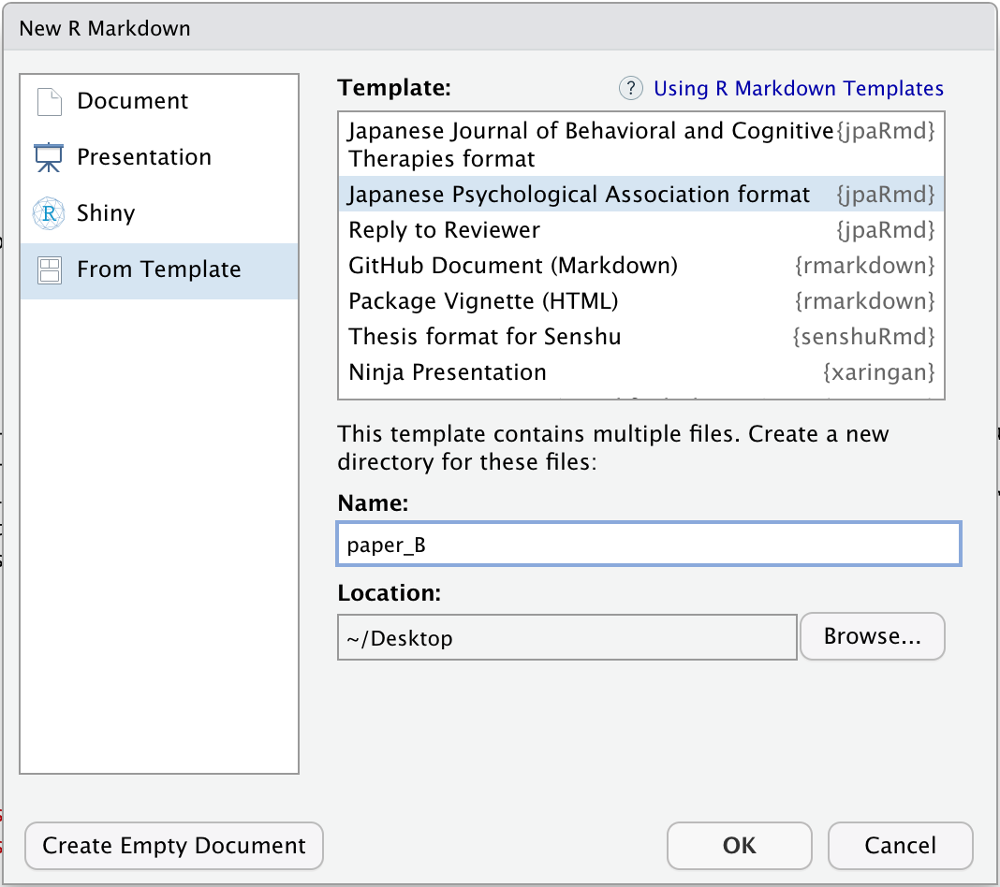
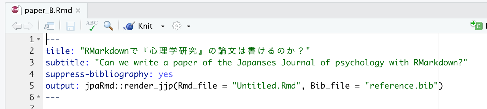
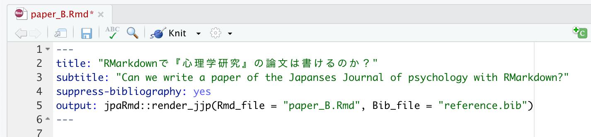
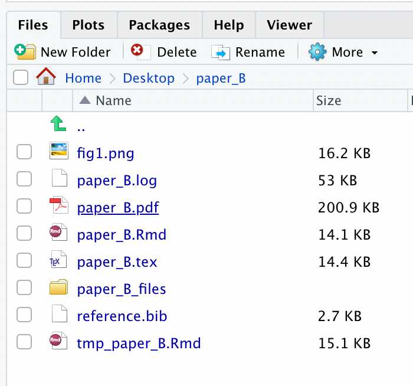
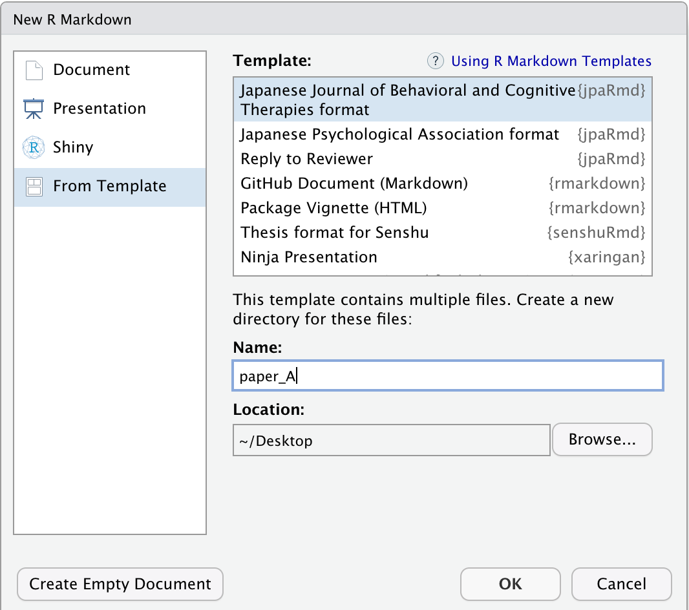
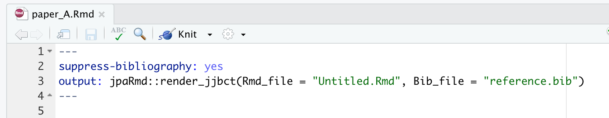
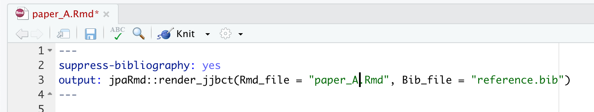
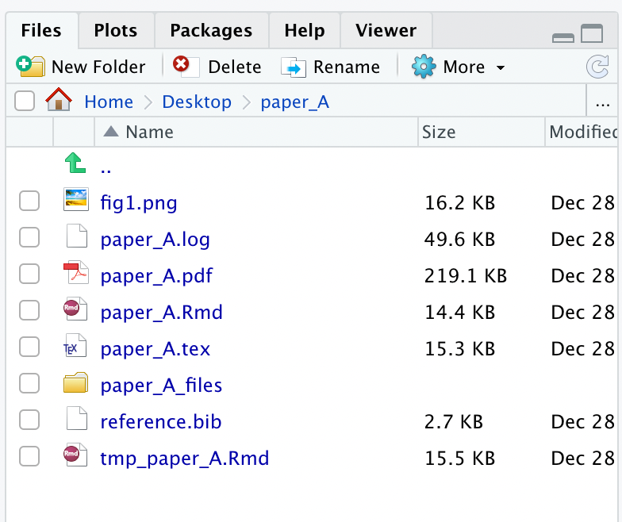
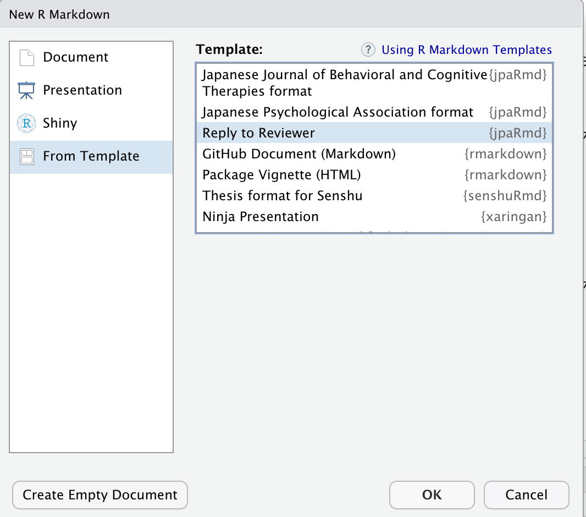

<!-- README.md is generated from README.Rmd. Please edit that file -->

# jpaRmd

<!-- badges: start -->

<!-- badges: end -->

jpaRmdは，日本心理学会の『心理学研究』への投稿用PDF原稿をRmarkdownで作成するためのテンプレートを提供するRパッケージです。[日本心理学会の「執筆・投稿の手びき(2015年版)」](https://psych.or.jp/manual/)に基づいています。また，認知行動療法学会の『認知行動療法』のテンプレートも用意しています。

## インストール

以下のコマンドをRコンソールに打ち込んで，Github経由でインストールしてください(remotesがない方はinstall.packages()でインストールください)。

    # install.packages("remotes")
    remotes::install_github("ykunisato/jpaRmd")

## 使用法

### 『心理学研究』

RStudioで，「File」 -\> 「New File」 -\> 「R Markdown…」
をクリックする。以下の画面がでてきたら，「From
Template」から「Japanese Psychological Association
format{jpaRmd}」を選びます。「Name:」は，デフォルトではUntitledになっていますが，適宜変更してください。以下では，paper\_Bという名前にしています。「OK」をクリックしてください。

Rmdファイルが自動的に開くと思います。以下のようにoutput:のjpaRmd::render\_jjp()内のRmd\_fileが“Untitled.Rmd”のままになっています。

これは，Rmdファイル名と同じにしないといけないので，変更します。今回は，paper\_Bという名前だったので，“paper\_B.Rmd”に変更します。これができたら，一度，「knit」をクリックしてください。

しばらくすると，以下のように，フォルダ内にいくつかファイルが作られます。PDFファイル（以下の場合は，paper\_B.pdf）を開くと，『心理学研究』に合ったフォーマットになっているかと思います。

### 引用文献についての注意

jpaRmdは，Bibファイルを使った引用が可能です。日本語文献の場合は，準備にいくつかルールがあります（文字コードはUTF-8，yomiを追加など）。[jpa\_citeに合ったBibファイルの作り方](https://qiita.com/kosugitti/items/63140ead7942d4e9b1d7)を参照いただいて，Bibファイルをご準備ください。

引用にあたっては，RStudioのアドインの[citr](https://github.com/crsh/citr)を使うと楽と思います。なお，Bibファイルを使って引用すると，「国里・片平・沖村・山下(2019)は，」としたい場合，@kunisato2019
という引用キーをつかって引用します（引用キーはBibファイルで設定します）。その場合に，「@kunisato2019
は，」のように，引用キーの後ろにスペースをいれるようにお願いします（「@kunisato2019は」としないでください）。

### 『認知行動療法研究』

RStudioで，「File」 -\> 「New File」 -\> 「R Markdown…」
をクリックする。以下の画面がでてきたら，「From
Template」から「Japanese Journal of Behavioral and Cognitive Therapies
format{jpaRmd}」を選びます。「Name:」は，デフォルトではUntitledになっていますが，適宜変更してください。以下では，paper\_Aという名前にしています。「OK」をクリックしてください。

Rmdファイルが自動的に開くと思います。以下のようにoutput:のjpaRmd::render\_jjbct()内のRmd\_fileが“Untitled.Rmd”のままになっています。

これは，Rmdファイル名と同じにしないといけないので，変更します。今回は，paper\_Aという名前だったので，“paper\_A.Rmd”に変更します。これができたら，一度，「knit」をクリックしてください。

しばらくすると，以下のように，フォルダ内にいくつかファイルが作られます。PDFファイル（以下の場合は，paper\_A.pdf）を開くと，『認知行動療法研究』に合ったフォーマットになっているかと思います。

### Research Compendium

Research
Compendiumの関数も用意しています。以下のように，『心理学研究』用のset\_rc\_jpa()関数もしくは『認知行動療法研究』用のset\_rc\_jabct()関数を使って，引数にプロジェクト名をいれると（なおスペースは避けてください），Rmdファイルや解析，データを配置するフォルダなども準備されます。

  - 『心理学研究』用Research Compendium

<!-- end list -->

    library(jpaRmd)
    set_rc_jpa("rmarkdown_for_reproducibility")

  - 『認知行動療法研究』用Research Compendium

<!-- end list -->

    library(jpaRmd)
    set_rc_jabct("rmarkdown_for_reproducibility")

上記を実行すると“rmarkdown\_for\_reproducibility”という名前のディレクトリーの下に以下の下位ディレクトリーができます。paperディでクトリ内のpaper.Rmdを開いて，Knitを押してください。PDFが生成されます。

  - analysis: 分析用ファイルを置く場所
  - data：　データを置く場所
  - function：　分析で使う汎用関数を定義したりした場合にそのファイルを置く場所
  - materials：　研究で使ったマテリアルを置く場所
  - paper：　論文原稿を置く場所
  - README.md

### 査読コメントに対するリプライと修正対照表

査読コメントに対するリプライと修正対照表を作ることができます。RStudioで，「File」 -\> 「New File」 -\> 「R
Markdown…」 をクリックする。以下の画面がでてきたら，「From Template」から「Reply to
Reviewer{jpaRmd}」を選びます。「OK」をクリックしてください。

詳しい使い方は，[jpaRmdで再現可能な査読対応をしちゃおう！](https://cpp-laboratory.hatenablog.com/entry/2020/12/19/054240)を参照ください。
